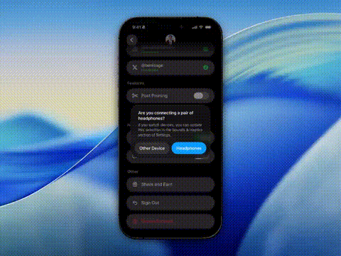

<h1 align="center">UnionToast</h1>

<p align="center">
  
</p>

UnionToast gives SwiftUI apps an iOS 26-style toast that feels native out of the box while staying fully customizable.

## Features

- SwiftUI `.toast` modifiers for both boolean bindings and identifiable items, each with `onDismiss`
- Dynamic Island toast style that animates from the island on supported devices
- System-style replacement choreography tuned for iOS 26 (liquid glass) and iOS 18 (material fade)
- Smooth entrance and swipe-to-dismiss animations with automatic timer pause on interaction
- Automatic liquid glass background on iOS 26 and `.regularMaterial` fallback elsewhere, customizable via `.toastBackground`
- Overlay window architecture to keep presentation independent from the view hierarchy
- Imperative `ToastController` APIs, including item-based presentations and replacement support

## Installation

Add the package with Swift Package Manager:

```swift
.package(url: "https://github.com/unionst/union-toast.git", from: "1.0.0")
```

Then add `UnionToast` to the target dependencies that should show toasts.

## Usage

```swift
@State private var isShowingToast = false

Button("Show Toast") { isShowingToast = true }
    .toast(isPresented: $isShowingToast) {
        Label("Invitation sent", systemImage: "paperplane.fill")
    }
```

### Boolean modifier

```swift
import UnionToast

struct ContentView: View {
    @State private var isShowingToast = false

    var body: some View {
        Button("Send Invitation") {
            isShowingToast = true
        }
        .toast(isPresented: $isShowingToast, onDismiss: handleToastDismiss) {
            Label("Invitation sent", systemImage: "paperplane.fill")
                .font(.headline)
        }
    }

    private func handleToastDismiss() {
        // Update analytics or state when the toast completes
    }
}
```

The modifier applies the default styling automatically. To change the auto-dismiss timing:

```swift
.toast(isPresented: $isShowingToast, dismissDelay: .seconds(3)) {
    Text("Quick update")
        .font(.headline)
}
```

### Item-based modifier

Use the item overload when each toast corresponds to a distinct piece of data. Identifiable & `Equatable` items participate in the system replacement choreography automatically.

```swift
struct AlertToast: Identifiable, Equatable {
    var id: UUID = .init()
    var title: String
    var message: String
}

struct ItemToastExample: View {
    @State private var activeToast: AlertToast?

    var body: some View {
        VStack(spacing: 16) {
            Button("Show success") {
                activeToast = AlertToast(title: "Success", message: "This will auto-dismiss.")
            }

            Button("Show warning") {
                activeToast = AlertToast(title: "Warning", message: "Replacing any visible toast.")
            }
        }
        .toast(item: $activeToast, onDismiss: handleDismiss) { toast in
            VStack(alignment: .leading, spacing: 4) {
                Text(toast.title).font(.headline)
                Text(toast.message).font(.subheadline)
            }
        }
    }

    private func handleDismiss() {
        // Clear additional state if needed
    }
}
```

### Imperative API

`ToastController` exposes the same behavior for callers that prefer to trigger toasts programmatically (for example from services or reducers).

```swift
import UnionToast

func presentDownloadFinishedToast() {
    ToastController.show(dismissDelay: .seconds(4)) {
        Label("Download complete", systemImage: "checkmark.circle.fill")
            .font(.headline)
    }
}

func presentAccountToast(account: Account) {
    ToastController.show(item: account, dismissDelay: .seconds(5)) { account in
        VStack(alignment: .leading) {
            Text("Signed in")
                .font(.headline)
            Text(account.email)
                .font(.subheadline)
        }
    }
}
```

### Customizing the background

Override the default appearance by setting a toast background configuration anywhere in the view hierarchy. This affects the environment for both modifier and controller-driven toasts.

```swift
struct CustomStylingView: View {
    var body: some View {
        content
            .toastBackground(
                .ultraThinMaterial,
                shape: RoundedRectangle(cornerRadius: 20, style: .continuous),
                glassEffect: .disabled,
                stroke: .white.opacity(0.15),
                padding: EdgeInsets(top: 10, leading: 20, bottom: 10, trailing: 20)
            )
    }

    private var content: some View {
        // Your app content
    }
}
```

On iOS 26 the default `glassEffect` resolves to `.regular`, so the toast card appears with the liquid glass aesthetic. Set `glassEffect: .clear` for a lighter variant or `.disabled` to fall back to the provided background style.

### Dynamic Island style

On devices with a Dynamic Island, toasts can animate directly from the island for a more integrated feel. On devices without a Dynamic Island, the toast automatically falls back to the regular style.

<p align="center">
  <video src="assets/dynamic-island-demo.mp4" width="300" autoplay loop muted playsinline></video>
</p>

```swift
.toast(isPresented: $showToast, style: .dynamicIsland) {
    Label("Copied to clipboard", systemImage: "doc.on.doc.fill")
}
```

The Dynamic Island style uses a 3-second default dismiss delay (versus 6.5 seconds for regular toasts) and supports swipe-up to dismiss.

## Behavior & defaults

- Toasts auto-dismiss after 6.5 seconds unless a custom `dismissDelay` is provided.
- Interacting with the toast (hold or drag) pauses the timer; releasing resumes it.
- Swiping up dismisses the toast with the same blur/squish animation used by the auto-dismiss path.
- When a new toast arrives while one is on screen, the existing toast animates out while the new one animates in, matching system notification behavior.
- Item-based presentations automatically ignore duplicate items that repeat within ~1 second to avoid accidental double posts.
- Overlay windows are automatically created per scene, so toasts stay above modals and sheets without additional setup.

## Public API

- `View.toast(isPresented:style:onDismiss:dismissDelay:content:)`
- `View.toast(item:style:onDismiss:dismissDelay:content:)` (`Item: Identifiable & Equatable`)
- `View.toastBackground(alignment:content:)` and `View.toastBackground(_:)` for `ShapeStyle` backgrounds
- `ToastController.show(dismissDelay:content:)`
- `ToastController.show(item:dismissDelay:onDismiss:content:)`
- `ToastController.showWithHaptic(dismissDelay:haptic:content:)`
- `ToastController.dismiss()` / `ToastController.remove()`

## Requirements

- iOS 18.0 or newer
- Swift 6.1 or newer
- Xcode 16 or newer

## Dependencies

- [UnionHaptics](https://github.com/unionst/union-haptics)
- [UnionScroll](https://github.com/unionst/union-scroll)
- [UnionGestures](https://github.com/unionst/union-gestures)